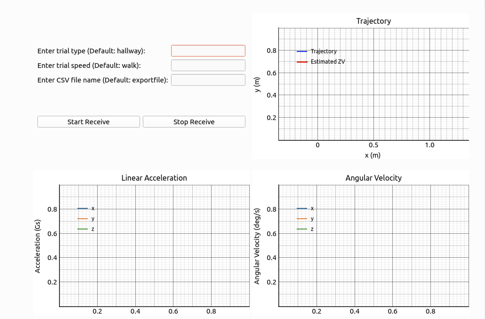

# Real-time implementation of a foot-mounted Inertial Navigation System (INS)

A real-time implementation of a foot-mounted Inertial Navigation System adapted from [PyShoe](https://github.com/utiasSTARS/pyshoe). This project uses a PyQt6-based application to collect and process IMU data into state estimates, which are displayed in real-time. The data receiver is adapted from example receive code from the MT SDK located in the MT Software Suite 2022. Stance Phase Optimal Detection (SHOE) zero-velocity detector and Extended Kalman Filter (EKF) are used for accurate state estimation.



## Requirements

- **Operating System**: Linux 
- **Hardware**: Xsens MTi 1-series Development Kit
- **Software Requirements**:
  - Python 3.x
  - PyQt6 (==6.8.1)
  - xsensdeviceapi (==2022.0.0) (from MT Software Suite 2022)
  - matplotlib==3.6.2
  - numpy==1.23.4
  - PyQt6_sip==13.10.0
  - pyqtgraph==0.13.7

## Installation

1. **Clone the repository**
   ```bash
   git clone https://github.com/oUesio/INS-app
   ```

2. **Install required libraries**
   ```bash
   pip install -r requirements.txt
   ```

3. **Install Xsens Software** *(required only for running the application, not for the utility scripts)*
   - Download the MT Software Suite 2022 from [Movella Support](https://www.movella.com/support/software-documentation).
   - Follow the instructions in the download to install the `xsensdeviceapi` wheel matching your Python version.

4. **Allow access to serial port** *(if necessary)*
   ```bash
   sudo chmod 666 /dev/ttyUSB0
   ```

## Running the Application

1. Connect the Xsens MTi device to your machine via USB.
2. Mount the device on top of the instep of your right shoe beneath the shoelaces.
3. Run the application:
   ```bash
   python main.py
   ```
4. Use the GUI to start and stop recording. State estimates will update in real time. Stopping saves the session data.

## Utility Scripts

- `calc_error.py`: Calculates the statistics for the results, such as average loop closure error, relative error, and standard deviation.
- `estimate_graphs.py`: Regenerates trajectory plots using the state estimates from the recorded trials.
- `simulate_realtime.py`: Emulates real-time processing by batching recorded raw IMU data.